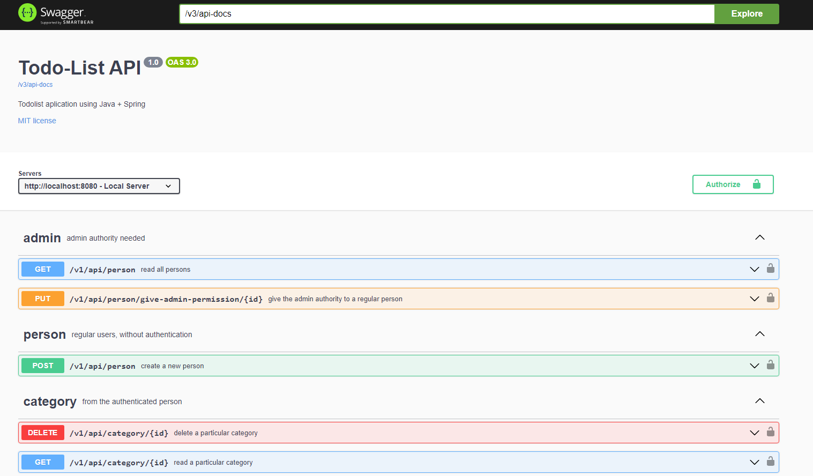

<h1 align="center">
    <span>Swagger</span>
    
</h1>

O swagger é uma ferramente utilizada para documentar nossas APIs. Assim, conseguimos padronizar a maneira como explicamos nossos endpoints para outros devs. 


## Utilizando swagger com Java + Spring
Para documentar nossa spring API é bem simples. Basta seguirmos esses passos:

1. Colocar a dependencie da openApi(swagger):
    ```xml
    <dependency>
        <groupId>org.springdoc</groupId>
        <artifactId>springdoc-openapi-starter-webmvc-ui</artifactId>
        <version>2.2.0</version>
    </dependency>
    ```
    Quando colocamos essa dependencie na nossa aplicacao, automaticamente já recebemos uma pagina HTML do swagger. Para acessar essa pagina, acessamos a seguinte URI:


    `http://localhost:8080/swagger-ui/index.html`


<hr>
<br>

2. Ir na nossa class de configuracao de seguranca, onde contem `securityFilterChain()` method, e permitir o acesso aos seguintes endpoints: 


    - `/api/v1/auth/**`
    - `/v3/api-docs/**`
    - `/v3/api-docs.yaml`
    - `/swagger-ui/**`
    - `/swagger-ui.html`

    <br>
    
    `permitAll()`

<hr>
<br>

3. Criar uma class de configuracao para o swagger.

    É aqui que vamos configurar toda a pagina do swagger. Inclusive, setar a seguranca (basic auth, JWT, etc...).

    ```java
    package br.com.lGabrielDev.todolist_project.swagger;

    import io.swagger.v3.oas.annotations.OpenAPIDefinition;
    import io.swagger.v3.oas.annotations.enums.SecuritySchemeIn;
    import io.swagger.v3.oas.annotations.enums.SecuritySchemeType;
    import io.swagger.v3.oas.annotations.info.Contact;
    import io.swagger.v3.oas.annotations.info.Info;
    import io.swagger.v3.oas.annotations.info.License;
    import io.swagger.v3.oas.annotations.security.SecurityRequirement;
    import io.swagger.v3.oas.annotations.security.SecurityScheme;
    import io.swagger.v3.oas.annotations.servers.Server;
    import io.swagger.v3.oas.annotations.tags.Tag;

    @OpenAPIDefinition(
        info = @Info(
            title = "Todo-List API",
            description = "Todolist aplication using Java + Spring",
            version = "1.0",
            license = @License(
                name = "MIT license",
                url = "https://opensource.org/license/mit/"
            ),
            contact = @Contact(
                name = "lGabrielDev"
            )
        ),
        servers = {
            @Server(
                description = "Local Server",
                url = "http://localhost:8080"
            )
        },
        tags = {
            @Tag(name = "admin", description = "admin authority needed"),
            @Tag(name = "person", description = "regular users, without authentication"),
            @Tag(name = "category", description = "from the authenticated person"),
            @Tag(name = "task", description = "from the authenticated person"),
        },
        security = {
            @SecurityRequirement(name = "simpleBasicAuth") //we pass the SecurityScheme 'name'
        } 
    )
    @SecurityScheme(
        name = "simpleBasicAuth", //you can choose whatever you want
        scheme = "basic",
        type = SecuritySchemeType.HTTP,
        in = SecuritySchemeIn.HEADER
    )
    public class SwaggerConfig {}
    ```

<hr>
<br>

4. Ir em cada controller da nossa API e personalizar as responses.

    ```java
    @RestController
    @RequestMapping("/v1/api")
    public class PersonController {
        
        //injected attributes
        @Autowired
        private PersonService personService;

        // ----------------------------------- CREATE -----------------------------------
        @Operation(
            tags = {"person"},
            summary = "create a new person",
            description = "You don't need to be authenticated to create a person. Anyone can do that.",
            responses = {
                @ApiResponse(
                    responseCode = "201",
                    description = "CREATED - successfully.",
                    content = @Content(
                        mediaType = "application/json",
                        schema = @Schema(
                            implementation = PersonFullDto.class
                        )     
                    )
                ),
                @ApiResponse(
                    responseCode = "409",
                    description = "CONFLICT - username or password is wrong.",
                    content = @Content(
                        mediaType = "application/json",
                        schema = @Schema(implementation = DefaultExceptionBody.class)
                    )
                )
            } 
        )
        @PostMapping("/person")
        public ResponseEntity<PersonFullDto> createPerson(@RequestBody PersonCreateDto personDto){
            return ResponseEntity
                .status(HttpStatus.CREATED)
                .body(this.personService.createPerson(personDto));
        }

        // ------------------------- Give the ADMIN permission -------------------------
        @Operation(
            tags = {"admin"},
            summary = "give the admin authority to a regular person",
            description = "Only 'regular person' can receive that authority.",
            responses = {
                @ApiResponse(
                    responseCode = "200",
                    description = "OK - admin authority given sucessfully.",
                    content = @Content(
                        mediaType = "application/json",
                        schema = @Schema(
                            implementation = PersonFullDto.class
                        )     
                    )
                ), 
                @ApiResponse(
                    responseCode = "401",
                    description = "UNAUTHORIZED - username and password are wrong.",
                    content = @Content() //no content
                ), 
                @ApiResponse(
                    responseCode = "403",
                    description = "FORBIDDEN - authenticated person does not have the admin authority.",
                    content = @Content() //no content
                ), 
                @ApiResponse(
                    responseCode = "404",
                    description = "NOT_FOUND - person does not exists in our database.",
                    content = @Content(
                        mediaType = "application/json",
                        schema = @Schema(implementation = DefaultExceptionBody.class)
                    )
                ),
                @ApiResponse(
                    responseCode = "417",
                    description = "EXPECTATION_FAILED - person already has the admin authority.",
                    content = @Content(
                        mediaType = "application/json",
                        schema = @Schema(implementation = DefaultExceptionBody.class)
                    )
                )
            }
        )
        @PutMapping("/person/give-admin-permission/{id}")
        public ResponseEntity<PersonFullDto> giveAdminPermission(@PathVariable(value = "id") Long id){
            return ResponseEntity
                .status(HttpStatus.OK)
                .body(this.personService.giveAdminPermission(id));   
        }
        
        // ----------------------------------- READ -----------------------------------
        @Operation(
            tags = {"admin"},
            summary = "read all persons",
            responses = {
                @ApiResponse(
                    responseCode = "200",
                    description = "List of all persons.",
                    content = @Content(
                        mediaType = "application/json",
                        array = @ArraySchema(
                            schema = @Schema(
                                implementation = PersonWithoutTasksDto.class
                            )
                        )     
                    )
                ),
                @ApiResponse(
                    responseCode = "401",
                    description = "UNAUTHORIZED - username and password are wrong.",
                    content = @Content() //no content
                ), 
                @ApiResponse(
                    responseCode = "403",
                    description = "FORBIDDEN - authenticated person does not have the admin authority.",
                    content = @Content() //no content
                ), 
            }
        )
        @GetMapping("/person")
        public ResponseEntity<List<PersonWithoutTasksDto>> readAllPersons(){
            return ResponseEntity
                .status(HttpStatus.OK)
                .body(this.personService.readAllPersons());
        }
    }
    ```

<hr>
<br>

Depois de tudo setadinho, você terá algo parecido com isso:



Easy! 😎


