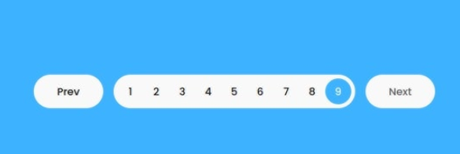

<h1 align="center">
    <span>Pagination</span>
    
</h1>

## O que é?
A paginação é uma técnica usada para dividir uma grande lista de dados em partes menores, chamadas "páginas". Em vez de carregar todos os dados de uma vez — o que pode ser lento e pesado —, a paginação carrega apenas uma quantidade limitada de itens por vez.

<br>

### Como a paginacao funciona no frontend?



<br>

No frontend, por exemplo, quando você vê um site com divisão de páginas, onde pode avançar, voltar ou escolher uma página específica, isso é paginação. Por debaixo dos panos, sempre que você clica em um desses botões, o navegador faz uma nova solicitação ao servidor, passando parâmetros (como o número da página). O servidor, então, retorna apenas os itens daquela página, mantendo a página leve e o sistema eficiente.

<hr>
<br>

## Configuracoes iniciais

Vamos trabalhar com um exemplo simples. Imagine uma api de "produtos". Vamos ter apenas 1 rota GET para listar esses produtos.

<br>


### 1. Subindo nosso container postgres


```bash
docker run \
--name docker_container \
-p 2222:5432 \
-e POSTGRES_USER=biel \
-e POSTGRES_PASSWORD=123 \
-e POSTGRES_DB=db_pagination \
-v volume_dados_banco:/var/lib/postgresql/data \
-d \
postgres:17.0;
```

<br>
<br>

### 2. Setando o aplication.properties

```properties
spring.datasource.url=jdbc:postgresql://localhost:portaTal/db_tal
spring.datasource.username=userTal
spring.datasource.password=senhaTal

spring.jpa.hibernate.ddl-auto=update
spring.jpa.properties.hibernate.show_sql=true
```

<br>
<br>

### 3. Criando nossa entidade "Produtos"

```java
    @Entity
@Table(name = "tb_product")
public class Product {
    
    //attributes
    @Id
    @GeneratedValue(strategy = GenerationType.IDENTITY)
    private Long id;

    private String name;
    private Double value;

    //constructors
    public Product(){}
    
    public Product(String name, Double value){
        this.name = name;
        this.value = value;
    }

    //getters and setters
    public Long getId() {
        return id;
    }

    public String getName() {
        return name;
    }

    public void setName(String name) {
        this.name = name;
    }

    public Double getValue() {
        return value;
    }

    public void setValue(Double value) {
        this.value = value;
    }
}
```

<br>
<br>

### 4. Rodamos a aplicacao para criar a table e inserimos 50 rows


```sql
INSERT INTO tb_product
	(name, value)
values
	('carrinho de bebê', 30.50),
	('bicicleta infantil', 150.00),
	('patinete elétrico', 450.00),
	('bola de futebol', 20.00)
-- ... 50 itens
```

<br>
<br>

### 5. Repository / Service / Controller

Primeiro vamos criar uma aplicacao sem paginacao.

<br>


#### Repository

```java
@Repository
public interface ProductRepository extends JpaRepository<Product, Long>{}
```

<br>

#### Service

```java
@Service
public class ProductService {
    
    //attributes
    private ProductRepository pr;

    //constructors
    public ProductService(ProductRepository pr){
        this.pr = pr;
    }

    // ============ GET ALL products ============
    public List<Product> getAllProducts(){
        return this.pr.findAll();
    }
}
```

<br>

#### Controller

```java
@RestController
@RequestMapping("/api")
public class ProductController {

    //attributes
    private ProductService ps;

    //constructors
    public ProductController(ProductService ps){
        this.ps = ps;
    }
    

    // ============ GET ALL products ============
    @GetMapping("/products")
    public ResponseEntity<List<Product>> getAllProducts(){
        return ResponseEntity
            .status(HttpStatus.OK)
            .body(this.ps.getAllProducts());
    }
}
```

<br>
<br>

### 6. Faça uma requisicao.

Perceba que retornou os 50 items.

⚠️ Imagine se tivesse 1 milhão de registros.... Olha o problema!

Por isso, precisamos paginar.